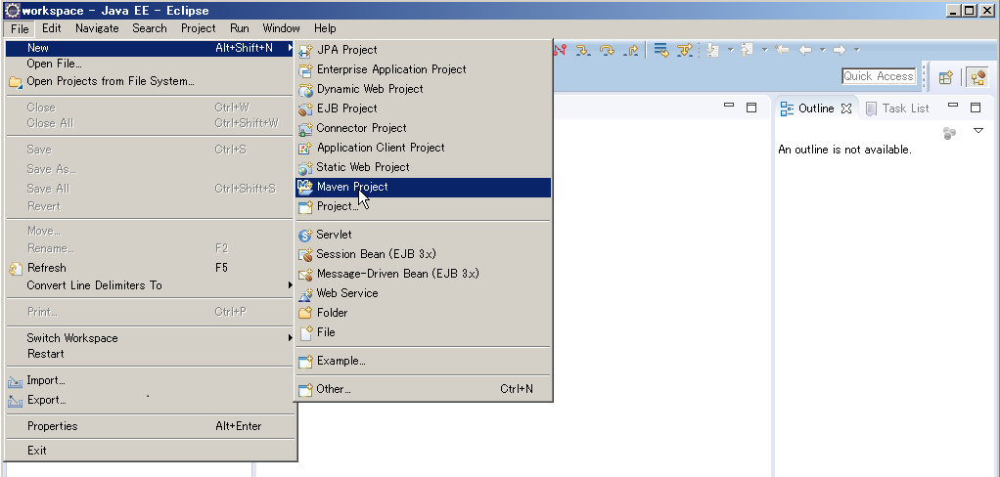
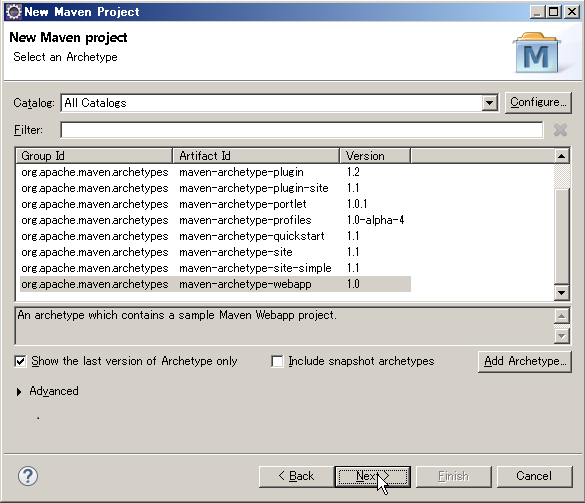
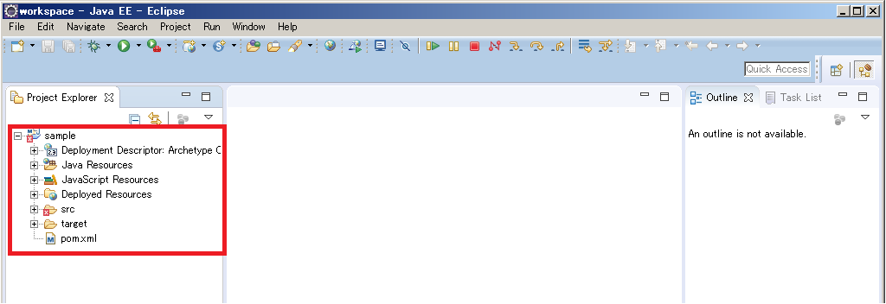
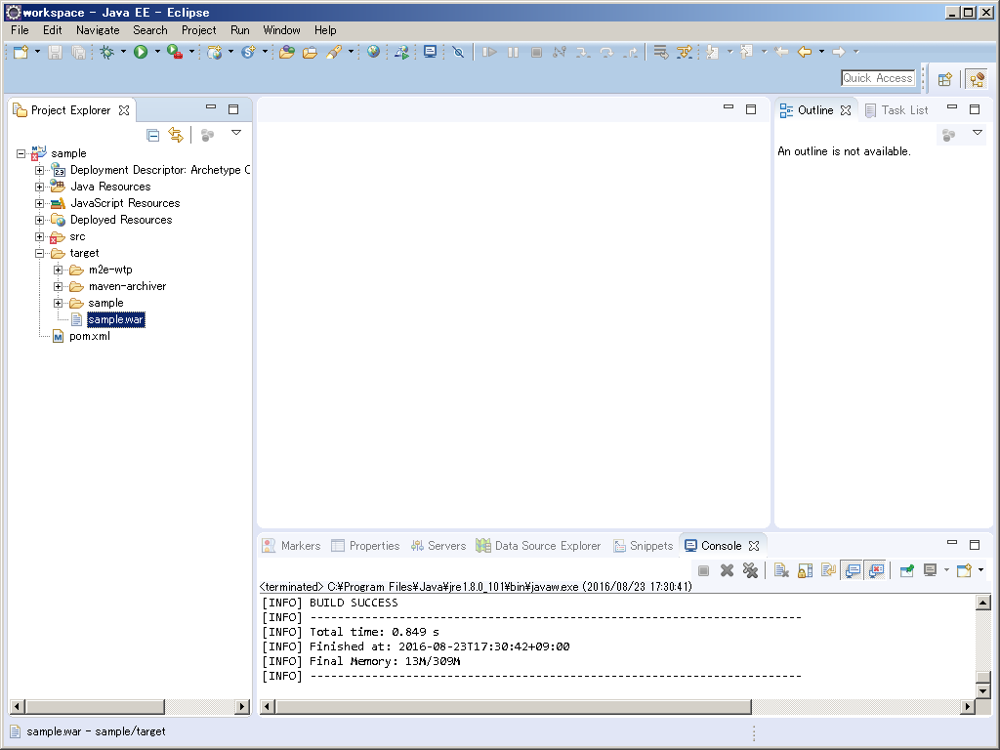
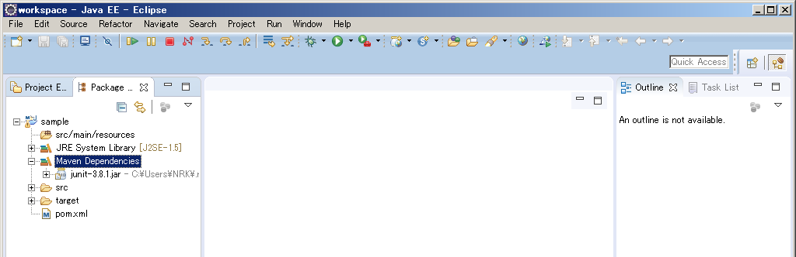
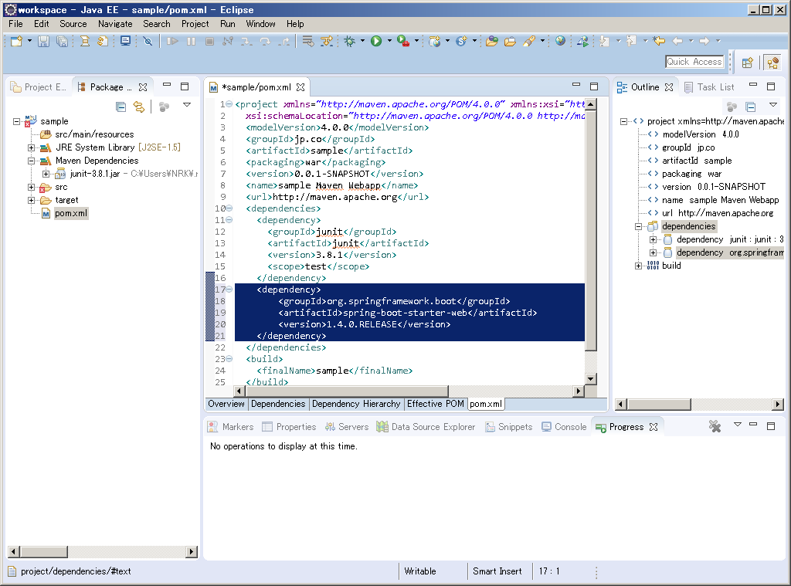
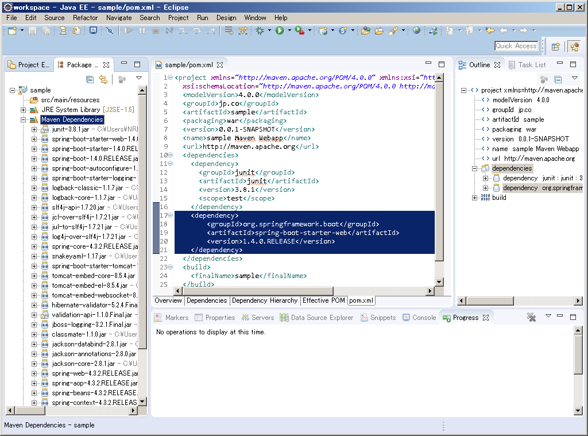

# Maven
****
### Mavenとは

  Java用プロジェクト管理ツールで、Apache Antに代わるものとして作られた。Apacheライセンスにて配布されているオープンソースソフトウェアである。
****
### 主な機能

* プロジェクトの依存するライブラリの管理
* プロジェクトの作成やコンパイルなどの各タスクの支援
****
### EclipseからのMavenの利用

* プロジェクト作成

    1．「File」→「New」→「Maven Project」
    

    2．「New Maven Project」ポップアップよりロケーションを選択して「Next」
    

    3．archetypeを選択して「Next」
    

    4．「Group Id」、「Artifact Id」を設定して「Next」
    

    5． プロジェクトのテンプレートが作成される
    
  
  ****
* warファイル作成

    1． プロジェクトのコンテキストメニュー→「Run As」→「Maven Install」
    

    2． 「target」ディレクトリにwarファイルが作成される
    
  ****
* プロジェクトをクリーン (生成したファイルを削除)

    1． プロジェクトのコンテキストメニュー→「Run As」→「Maven Clean」
    

    2． 「target」ディレクトリの生成したファイルが削除される
    
  ****
* ライブラリの追加

  ※例として「Spring Boot Web Starter」の追加を行います

    1． Pacage Explorerより「Maven Dependencies」を確認
    
    デフォルトでjunitのjarが設定されている

    2． プロジェクト直下のpom.xmlを編集する
    
    ※入力内容は[Mavenリポジトリ](https://mvnrepository.com/artifact/org.springframework.boot/spring-boot-starter-web/1.4.0.RELEASE)よりコピーする

    3． 追加されたライブラリの確認
    
    「Spring Boot Web Starter」に依存関係があるライブラリが追加されている

  ****

