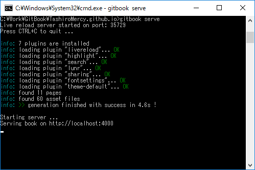
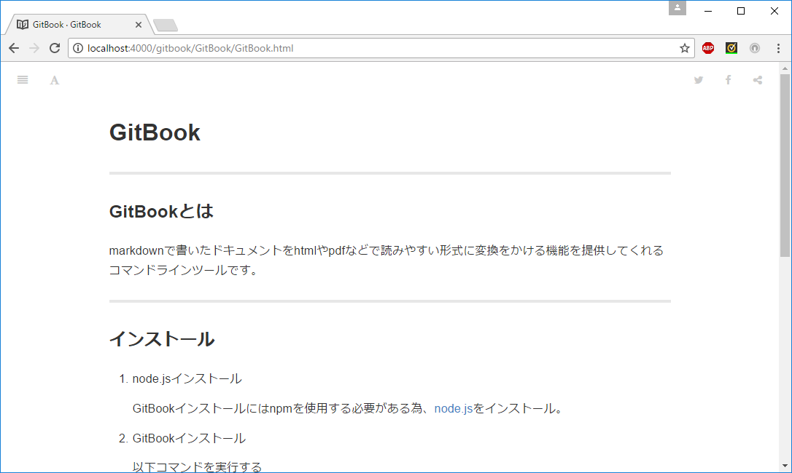

# GitBook
****
### GitBookとは
markdownで書いたドキュメントをhtmlやpdfなどで読みやすい形式に変換をかける機能を提供してくれるコマンドラインツールです。
****
### インストール
1. node.jsインストール

    GitBookインストールにはnpmを使用する必要がある為、[node.js](https://nodejs.org/en/)をインストール。

1. GitBookインストール

    以下コマンドを実行する

    ```MarkDown
    npm install -g gitbook-cli
    ```
****
### GitBookコマンド
1. gitbook init

　　以下の雛形ファイルが生成される。
　
  * README.md
  * SUMMARY.md

2. gitbook build

   MarkDownで記述したファイルがビルドされる。
   

3. gitbook serve

    ローカルサーバーが立ち上がります。
    

    `http://localhost:4000`にて確認可能。    
    
