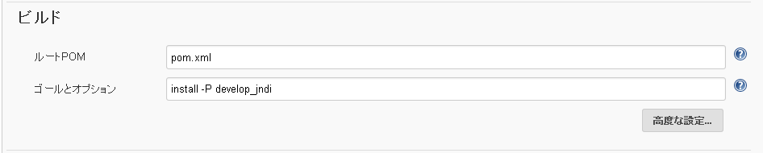
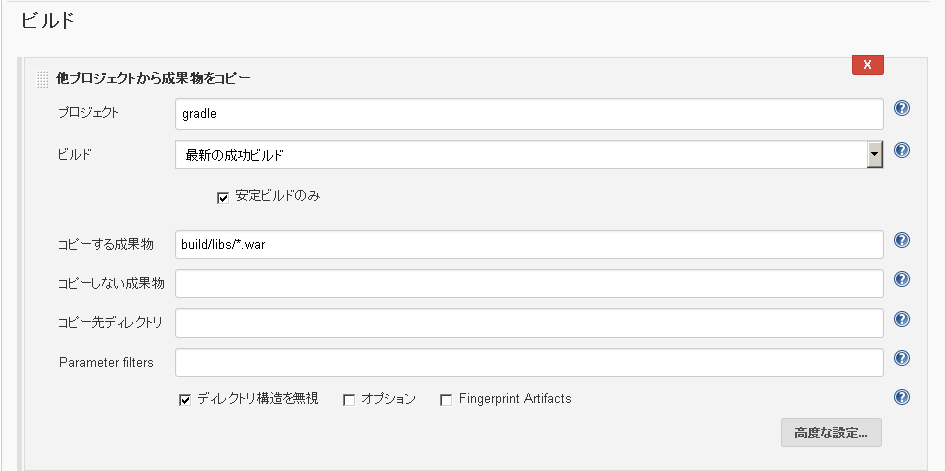
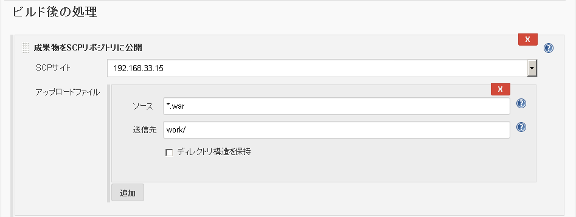

# jenkinsジョブ設定
****
### MavenプロジェクトBuild

  1. 新規ジョブ作成

    ジョブ名を入力して「Mavenプロジェクトのビルド」を選択
    
  1. ソースコード管理

    対象のソース管理ツール設定を定義

  1. ビルド
    
    ゴールとオプションには対象のMavenコマンドとオプションを指定

  1. ビルド後の処理

    warファイルを保管する
    

****
### GradleプロジェクトBuild

  1. 新規ジョブ作成

    ジョブ名を入力して「フリースタイルプロジェクトのビルド」を選択
    
  1. ソースコード管理

    対象のソース管理ツール設定を定義

  1. ビルド

    invoke Gradle scriptを選択
    
    Tasksに対象のGradleコマンドとオプションを指定

  1. ビルド後の処理

        warファイルを保管する

****
### warファイル転送

  1. 新規ジョブ作成

    ジョブ名を入力して「フリースタイルプロジェクトのビルド」を選択

  1. ビルド

    ビルド手順の追加で「他プロジェクトから成果物をコピー」を選択
    
    「他プロジェクトから成果物をコピー」は「Copy Artifact Plugin」適用で利用可能となる

  1. ビルド後の処理

    ビルド後の処理の追加で「成果物をSCPリポジトリに公開」を選択
    
    「成果物をSCPリポジトリに公開」は「Hudson SCP publisher plugin」適用で利用可能となる

****
### デフロイ

  1. 新規ジョブ作成

    ジョブ名を入力して「フリースタイルプロジェクトのビルド」を選択

  1. ビルド

    ビルド手順の追加で「シェルの実行」を選択

    ```
    // サービス停止
    sudo service tomcat stop
    ```
    ```
    // warファイルコピー
    sudo cp -f /home/jenkins/work/XXX.war /home/nepios/bin/apache-tomcat-8.0.32/webapps
    ```
    ```
    // サービス起動
    sudo service tomcat start
    ```
