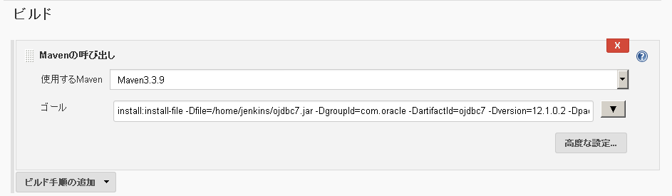

# Jenkins設定メモ
****
### Mavenでのojdbc設定

Mavenでojdbcを使用する場合、
センターリポジトリにjarを公開していない為、ローカル環境にダウンロードしなければ行けない。

  1. ojdbc7.jarをダウンロード
  1. ftp転送(home/vagrant)
  1. home/jenkinsディレクトリ作成
  1. ojdbc7.jarをhome/jenkinsにコピー
    ```
    cp /home/vagrant/ojdbc7.jar /home/jenkins
    ```
  1. ojdbc7.jarの所有者をjenkinsに変更
    ```
    chown -R jenkins. /home/jenkins
    ```
  1. masterにJAVA_HOMEを設定
    * javaパスの確認
    ```
    find /usr -name jre
    ```
    * jenkins環境変数設定方法

      Jenkinsの管理 → ノードの管理 → master
  1. ローカルリポジトリにmavenのパスを通す

    * 新規ジョブ作成
    * ビルド Mavenの呼出し
    * ゴール
    ```
    install:install-file -Dfile=/home/jenkins/ojdbc7.jar -DgroupId=com.oracle -DartifactId=ojdbc7 -Dversion=12.1.0.2 -Dpackaging=jar -DgeneratePom=true
    ```
    

****
### gitインストール
  ```
  yum install git
  ```
