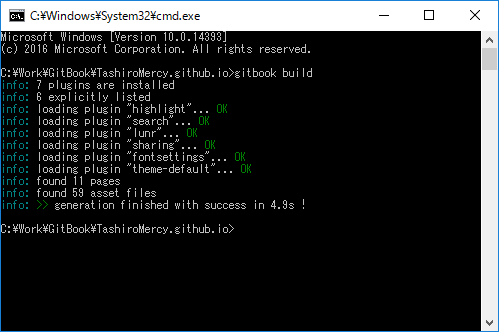
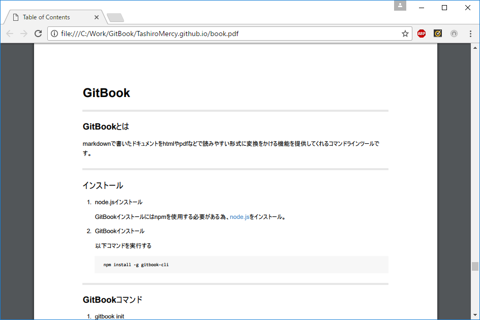

# GitBook
****
### GitBookとは
markdownで書いたドキュメントをhtmlやpdfなどで読みやすい形式に変換をかける機能を提供してくれるコマンドラインツールです。
****
### インストール
1. node.jsインストール

    GitBookインストールにはnpmを使用する必要がある為、[node.js](https://nodejs.org/en/)をインストール。

1. GitBookインストール

    以下コマンドを実行する

    ```MarkDown
    npm install -g gitbook-cli
    ```
****
### GitBookコマンド
1. 雛形ファイル生成<BR>   
雛形ファイルが生成される。
```MarkDown
gitbook init
```  
　  
2. ビルド<BR>   
MarkDownで記述したファイルがビルドされる。
```MarkDown
gitbook build
```
　  
3. ローカルサーバー起動   
ローカルサーバーが立ち上がります。
```MarkDown
gitbook serve
```
   
`http://localhost:4000`にて確認可能。    

　  
4. PDF出力   
PDFファイルが生成される。   
※calibreをインストールする必要があります。
```MarkDown
gitbook pdf
```   

