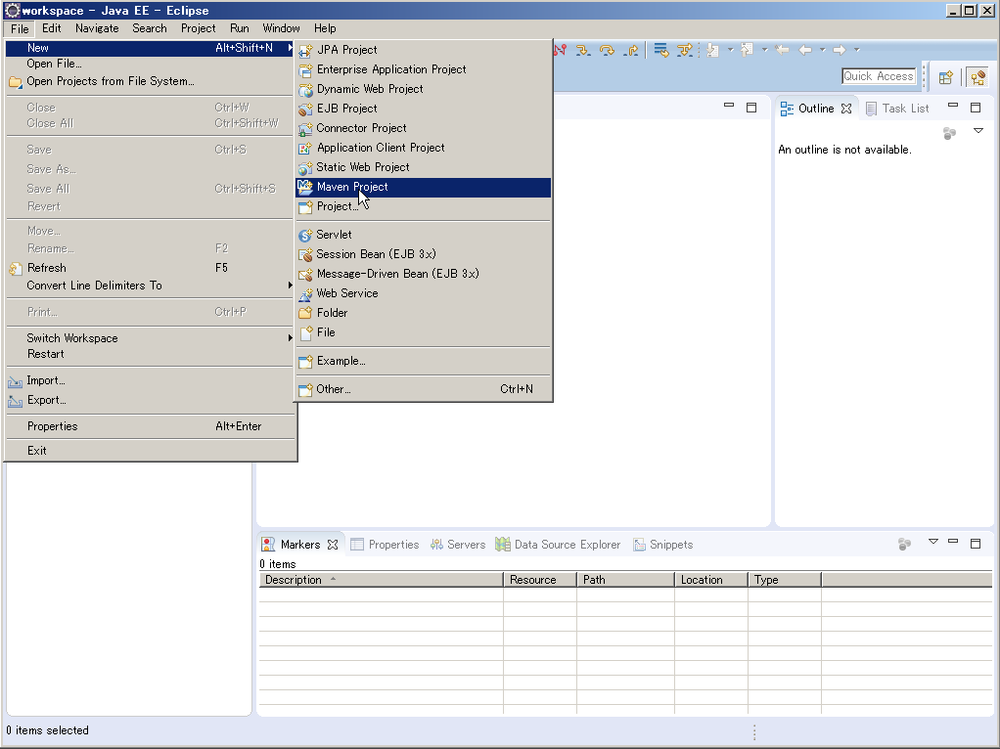
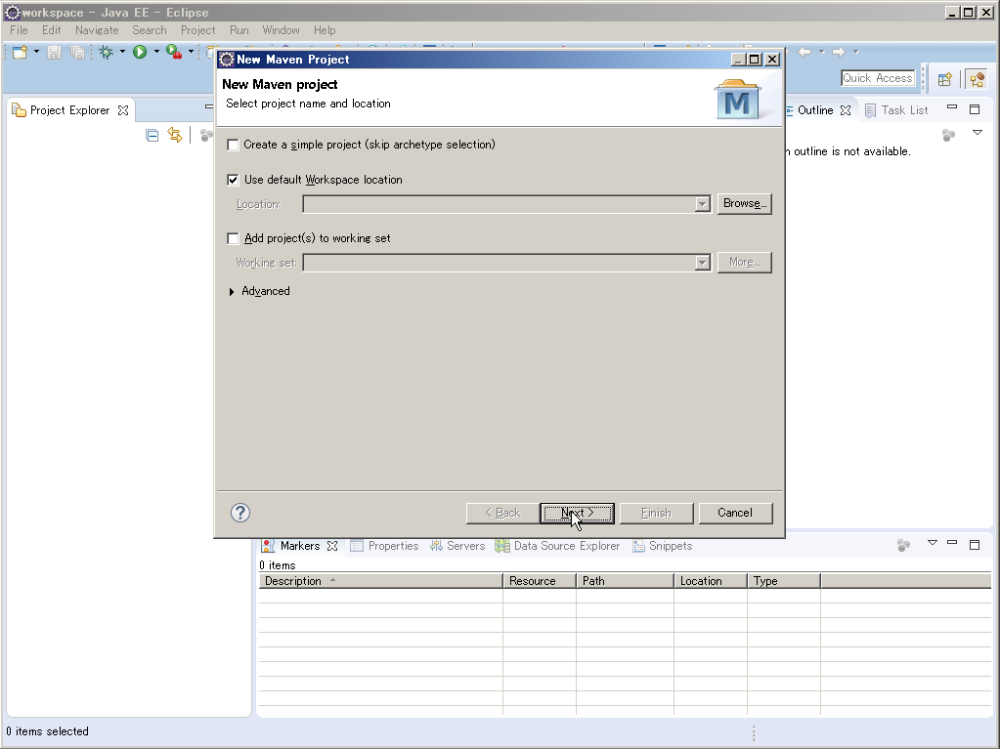
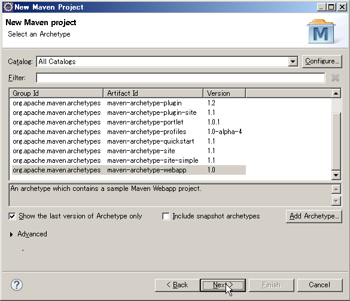
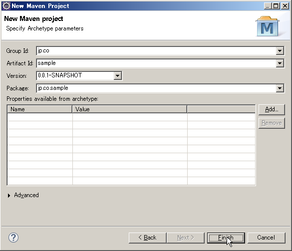
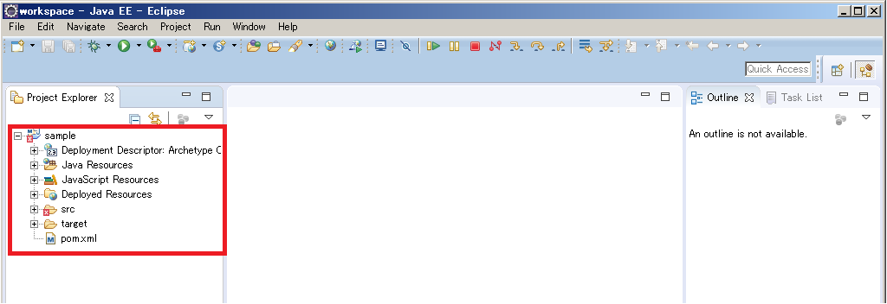
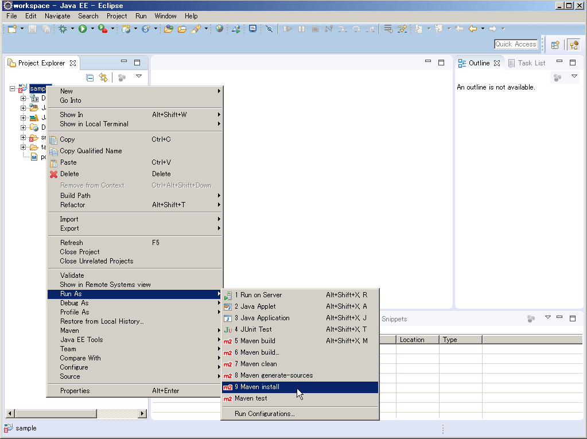

# Maven
****
### Mavenとは

  Java用プロジェクト管理ツールで、Apache Antに代わるものとして作られた。Apacheライセンスにて配布されているオープンソースソフトウェアである。
****
### 主な機能

* プロジェクトの依存するライブラリの管理
* プロジェクトの作成やコンパイルなどの各タスクの支援
****
### EclipseからのMavenの利用

* プロジェクト作成

  1． 「File」→「New」→「Maven Project」
  

  1． ディフォルトのまま「Next」
  

  1． 「maven-archetype-webapp」を選択して「Next」
  

  1． 「Group Id」、「Artifact Id」を設定して「Next」
  

  1． プロジェクトのテンプレートが作成される
  
  ****
* warファイル作成

  1． プロジェクトのコンテキストメニュー→「Run As」→「Maven Install」
  

  1． 「target」ディレクトリにwarファイルが作成される
  
  ****
* プロジェクトをクリーン (生成したファイルを削除)

  1． プロジェクトのコンテキストメニュー→「Run As」→「Maven Clean」
  

  1． 「target」ディレクトリの生成したファイルが削除される
  
  ****
